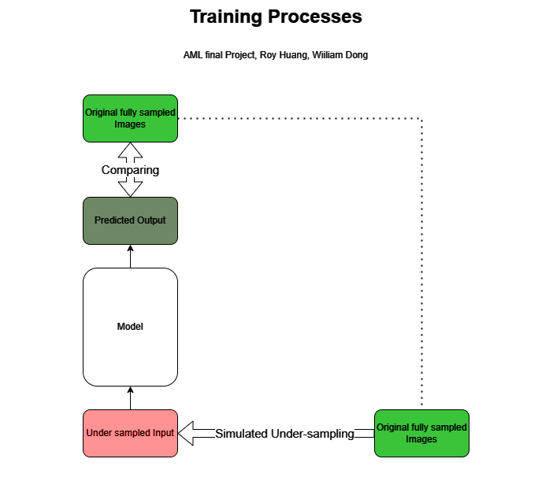

In this project we are exploring solutions for accelerating MRI image processing, using machine learning techniques. 

In the first part of the project, we are using MODL framework to train a model to remove aliasing artifacts on MRI images due to undersampling. We are using the following literature's repository as our template. 

Aggarwal, H. K., Mani, M. P., & Jacob, M. (2018). MoDL: Model-based deep learning architecture for inverse problems. IEEE transactions on medical imaging, 38(2), 394-405.

Part One Diagram 

In the second part of the project, we will train a GAN model to generate segmented images. 
